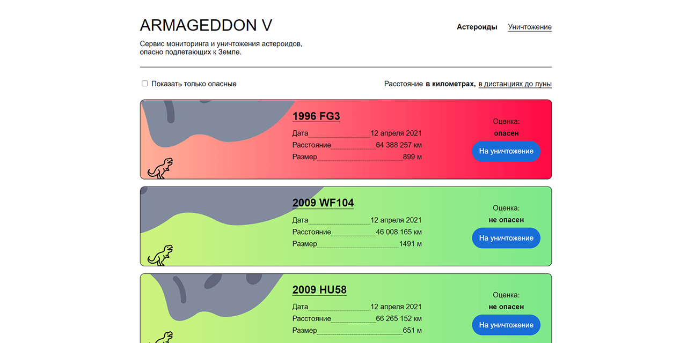

# Armageddon V
**A sample frontend project on React-Next.js-TypeScript**

A sample frontend application for browsing and destroying near Earth asteroids.

* Current live version at [https://asteroids-nasa.vercel.app/](https://asteroids-nasa.vercel.app/)

---
## Features

* Asteroids info is loaded from [NASA API](https://api.nasa.gov)
* There are 3 routes: Main page (all asteroids), Single asteroid page and Asteroids to destroy page.
* All pages are built with responsive layout.

#### Main page
* Asteroids are loaded indefinitely by scroll.
* Initially, the data for 7 days from current date is fetched, it is added to a page from the React state continuously by a scroll. When the end of the data is reached, a new part of the data for the next 7 days is fetched and added to the state.
* The size of the asteroid picture is based on the size from the data.
* Potentially hazardous asteroids are marked with red and by the text at the right section.
* There is a filter to show only hazardous asteroids. The distance from Earth can be shown in kilometers or in Lunar distance.
* Each asteroid can be marked for destroying.

#### Single asteroid page
* The data is fetched by a separate call to the API.
* The route is built dynamically, the asteroid id is taken from the url string.
* Additional info shows every asteroid approach to Earth from 1900 to 2200.
* Each asteroid can be marked for destroying from this page also.

#### Asteroids to destroy page
* The list of all asteroids marked for destroying is shown.
* Each asteroid can be removed from the list.
* A confirmation button sends a team to destroy selected asteroids.

## Technology

* React (functional components)
* Next.js
* SWR (client-side data fetching)
* TypeScript

## Possible improvements

* Design improvements
* Animations
* Better work with types
* Removal of extra API request at main page mount
* Possible use of server-side data fetching
* Using state manager
* Back to top button
